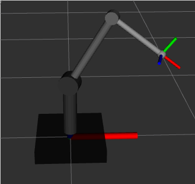

# learning_by_doing
A bunch of ROS packages for me to learn and test things out

## my_simple_manipulator

A 3 joint manipulator with a controller. It accepts command of type
- joint position values
- joint velocity
- cartesian point

and move the manipulator accordingly.

## tic_tac_toe_with_robot

A tic tac toe playing robot. The perception is performed with vision (web cam)
with opencv and the manipulation task is done with kuka youbot manipulator arm
with moveit!. The algorithm does not let the human player win.

